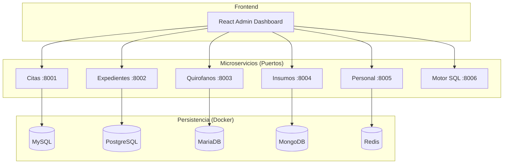

# 🏥 Sistema Hospitalario Distribuido + Motor SQL

**Alumno:** Jose Antonio Matuz Argueta - 6N - 100019199
**Proyecto Final:** Taller 4 (Microservicios) + Compiladores (Motor SQL)

---

## 🌟 Descripción General

Este proyecto representa una infraestructura de salud moderna y escalable, construida bajo una **Arquitectura de Microservicios Distribuidos**. El sistema gestiona desde citas médicas y expedientes clínicos hasta la orquestación en tiempo real de 30 quirófanos y el control de inventarios.

### Componentes Clave:
- **6 Microservicios Autónomos:** Desarrollados en **Python (FastAPI)** y **Go**, garantizando alto rendimiento y concurrencia.
- **Persistencia Multi-Base de Datos:** Implementación de **MySQL, PostgreSQL, MariaDB, MongoDB y Redis**, cada uno optimizado para su caso de uso específico.
- **Motor SQL Nativo:** Un compilador completo (Léxico, Sintáctico y Semántico) desarrollado en Go para gestionar la lógica de datos de forma independiente.
- **Dashboard de Control:** Interfaz administrativa moderna en **React 18** con actualizaciones en tiempo real.

---

## 🏗️ Arquitectura del Sistema

El sistema opera en una red de contenedores Docker, aislando cada servicio y su respectiva capa de persistencia:



---

## 🚀 Inicio Rápido (Local)

### 1. Requisitos Previos
- Docker Desktop
- Python 3.10+
- Go 1.21+
- Node.js 18+

### 2. Configuración del Entorno
```bash
# 1. Clonar y preparar entorno Python
python -m venv .venv
.\.venv\Scripts\activate
pip install -r requirements.txt

# 2. Levantar la infraestructura de Bases de Datos
docker-compose up -d

# 3. Poblar datos iniciales (Seed)
python scripts/seed_5dbs.py
```

### 3. Ejecución Masiva
Para facilitar el despliegue en desarrollo, utiliza el script automatizado:
```bash
# Ejecuta todos los microservicios en background
.\start.bat
```

### 4. Lanzar Frontend
```bash
cd frontend
npm install
npm run dev
```

---

## 🛠️ Stack Tecnológico

| Servicio | Tecnología | Base de Datos | Puerto |
| :--- | :--- | :--- | :--- |
| **Citas** | FastAPI | MySQL 8.0 | 8001 |
| **Expedientes** | FastAPI | PostgreSQL 15 | 8002 |
| **Quirofanos** | Go (Gin) | MariaDB 10.11 | 8003 |
| **Insumos** | FastAPI | MongoDB 6.0 | 8004 |
| **Personal** | FastAPI | Redis 7.0 | 8005 |
| **Motor SQL** | Go | Memoria/FS | 8006 |

---

## 🧠 Motor SQL (Compiladores)

El motor SQL es una pieza de ingeniería que simula el comportamiento de un gestor de bases de datos relacional, implementando las fases críticas de compilación:

1.  **Analizador Léxico:** Convierte el código SQL en tokens (claves, símbolos, cadenas, números).
2.  **Analizador Sintáctico:** Valida la estructura gramatical (ej. `CREATE TABLE` debe seguir un orden específico).
3.  **Analizador Semántico:** Verifica la lógica de negocio (existencia de tablas, tipos de datos compatibles).
4.  **Ejecutor:** Procesa la consulta y persiste los cambios o retorna resultados.

**Acceso:** `http://localhost:8006`

---

## 📡 Documentación y Pruebas

Cada microservicio expone su propia documentación interactiva mediante **Swagger UI**:

- 📝 **Citas API:** [http://localhost:8001/docs](http://localhost:8001/docs)
- 📂 **Expedientes API:** [http://localhost:8002/docs](http://localhost:8002/docs)
- 📦 **Insumos API:** [http://localhost:8004/docs](http://localhost:8004/docs)
- 👨‍⚕️ **Personal API:** [http://localhost:8005/docs](http://localhost:8005/docs)

---

## ☁️ Notas de Despliegue (AWS/Ubuntu)
El sistema está diseñado para ser desplegado en una instancia de **Ubuntu Server** mediante **Docker Compose**. Todas las URLs de conexión a bases de datos están parametrizadas mediante variables de entorno en los archivos `.env` y el `docker-compose.yml`.

---
*Proyecto desarrollado con fines académicos para la asignatura de Taller 4 y Compiladores.*
