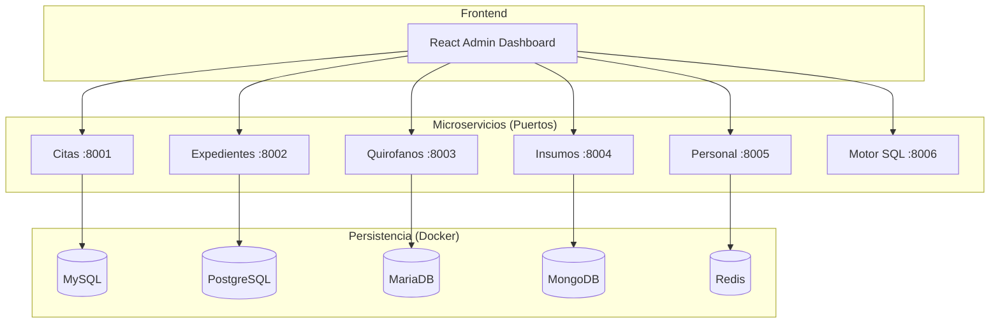

# 🏥 Sistema Hospitalario Distribuido + Motor SQL

**Alumno:** Jose Antonio Matuz Argueta - 6N - 100019199
**Proyecto Final:** Taller 4 (Microservicios) + Compiladores (Motor SQL)

---

## 🌟 Descripción General

Este proyecto representa una infraestructura de salud moderna y escalable, construida bajo una **Arquitectura de Microservicios Distribuidos**. El sistema gestiona desde citas médicas y expedientes clínicos hasta la orquestación en tiempo real de 30 quirófanos y el control de inventarios.

### Componentes Clave:
- **6 Microservicios Autónomos:** Desarrollados en **Python (FastAPI)** y **Go**, garantizando alto rendimiento y concurrencia.
- **Persistencia Multi-Base de Datos:** Implementación de **MySQL, PostgreSQL, MariaDB, MongoDB y Redis**, cada uno optimizado para su caso de uso específico.
- **Motor SQL Nativo:** Un compilador completo (Léxico, Sintáctico y Semántico) desarrollado en Go para gestionar la lógica de datos de forma independiente.
- **Dashboard de Control:** Interfaz administrativa moderna en **React 18** con actualizaciones en tiempo real.

---

## 🏗️ Arquitectura del Sistema

El sistema opera en una red de contenedores Docker, aislando cada servicio y su respectiva capa de persistencia:



---

## 🚀 Inicio Rápido (Local)

### 1. Requisitos Previos
- Docker Desktop
- Python 3.10+
- Go 1.21+
- Node.js 18+

### 2. Configuración del Entorno
```bash
# 1. Clonar y preparar entorno Python
python -m venv .venv
.\.venv\Scripts\activate
pip install -r requirements.txt

# 2. Levantar la infraestructura de Bases de Datos
docker-compose up -d

# 3. Poblar datos iniciales (Seed)
python scripts/seed_5dbs.py
```

### 3. Ejecución Masiva
Para facilitar el despliegue en desarrollo, utiliza el script automatizado:
```bash
# Ejecuta todos los microservicios en background
.\start.bat
```

En Linux/Ubuntu:
```bash
chmod +x start.sh
./start.sh
```

### 4. Lanzar Frontend
```bash
cd frontend
npm install
npm run dev
```

---

## 🛠️ Stack Tecnológico

| Servicio | Tecnología | Base de Datos | Puerto |
| :--- | :--- | :--- | :--- |
| **Citas** | FastAPI | MySQL 8.0 | 8001 |
| **Expedientes** | FastAPI | PostgreSQL 15 | 8002 |
| **Quirofanos** | Go (Gin) | MariaDB 10.11 | 8003 |
| **Insumos** | FastAPI | MongoDB 6.0 | 8004 |
| **Personal** | FastAPI | Redis 7.0 | 8005 |
| **Motor SQL** | Go | Memoria/FS | 8006 |

---

## 🧠 Motor SQL (Compiladores)

El motor SQL es una pieza de ingeniería que simula el comportamiento de un gestor de bases de datos relacional, implementando las fases críticas de compilación:

1.  **Analizador Léxico:** Convierte el código SQL en tokens (claves, símbolos, cadenas, números).
2.  **Analizador Sintáctico:** Valida la estructura gramatical (ej. `CREATE TABLE` debe seguir un orden específico).
3.  **Analizador Semántico:** Verifica la lógica de negocio (existencia de tablas, tipos de datos compatibles).
4.  **Ejecutor:** Procesa la consulta y persiste los cambios o retorna resultados.

**Acceso:** `http://localhost:8006`

---

## 🛠️ Actualizaciones Recientes (Estabilización y CRUD)

Se han implementado mejoras críticas para garantizar la estabilidad y funcionalidad completa del sistema en entornos de producción (AWS/Ubuntu):

### 1. Estabilización de Persistencia SQL
- **Citas (MySQL):** Integración total con la tabla `citas_legacy`. Se eliminó el uso de variables en memoria que causaban crasheos. Ahora, la creación de citas persiste el nombre del paciente, IDs autoincrementales y metadatos quirúrgicos directamente en el motor relacional.
- **Expedientes (PostgreSQL):** Migración total de listas en memoria a tablas relacionales persistentes. Se implementó un sistema de mapeo de datos para asegurar compatibilidad entre los nombres de columnas SQL (`num_expediente`) y las propiedades del Frontend (`numero_expediente_clinico`).

### 2. Gestión de Expedientes (CRUD Completo)
- **Edición y Eliminación:** La interfaz de **Expedientes Admin** ahora permite modificar y borrar registros existentes directamente en PostgreSQL mediante los métodos `PUT` y `DELETE`.
- **Flujo de Trabajo Dinámico:** Se corrigió el error que obligaba a seleccionar una cita nueva al editar un expediente existente. Ahora el modo edición es independiente del flujo de creación.

### 3. Sistema de Estudios Clínicos Persistente
- **Tabla `estudios_clinicos`:** Se añadió una nueva tabla en PostgreSQL con relación `1:N` para almacenar Laboratorios, Cardiogramas e Imagenología de forma permanente.
- **Validación en Tiempo Real:** El endpoint `/validar` ahora consulta la base de datos para verificar estudios reales, permitiendo que el estado de "Listo para Cirugía" (verde) persista tras refrescar la página.

### 4. Mejoras en UX/UI
- **Manejo de Horarios:** Se implementó la recarga automática de disponibilidad de médicos al cambiar la fecha de cirugía en el formulario.
- **Corrección de Estado:** Se resolvieron errores de "undefined ID" y nombres genéricos en el servicio de Citas, asegurando que el Dashboard refleje datos reales inmediatamente tras la creación.

### 5. Orquestacion de Cirugias (Auto + Manual)
- **Auto-inicio:** Expedientes arranca cirugias automaticamente cuando el expediente esta listo (laboratorios completos) y la hora programada ya llego.
- **Inicio manual Admin:** El Dashboard abre un modal por quirofano para seleccionar un expediente listo y forzar el inicio.
- **Datos obligatorios:** Quirofanos requiere medico, paciente, anestesiologo, especialidad y expediente. Se eliminaron valores por defecto.

---

## 📡 Documentación y Pruebas

Cada microservicio expone su propia documentación interactiva mediante **Swagger UI**:

- 📝 **Citas API:** [http://localhost:8001/docs](http://localhost:8001/docs)
- 📂 **Expedientes API:** [http://localhost:8002/docs](http://localhost:8002/docs)
- 📦 **Insumos API:** [http://localhost:8004/docs](http://localhost:8004/docs)
- 👨‍⚕️ **Personal API:** [http://localhost:8005/docs](http://localhost:8005/docs)

---

## ☁️ Notas de Despliegue (AWS/Ubuntu)
El sistema está diseñado para ser desplegado en una instancia de **Ubuntu Server**. Todas las URLs de conexión a bases de datos están parametrizadas mediante variables de entorno en los archivos `.env` y el `docker-compose.yml`.

Pasos recomendados (resumen):
- Instalar Docker, Docker Compose, Go, Python y Node.
- Clonar el repositorio y ejecutar `docker-compose up -d`.
- Crear el entorno Python y ejecutar `pip install -r requirements.txt`.
- Ejecutar `python scripts/seed_5dbs.py`.
- Levantar los servicios con `./start.sh` y el Frontend con `npm run dev`.

---
*Proyecto desarrollado con fines académicos para la asignatura de Taller 4 y Compiladores.*
