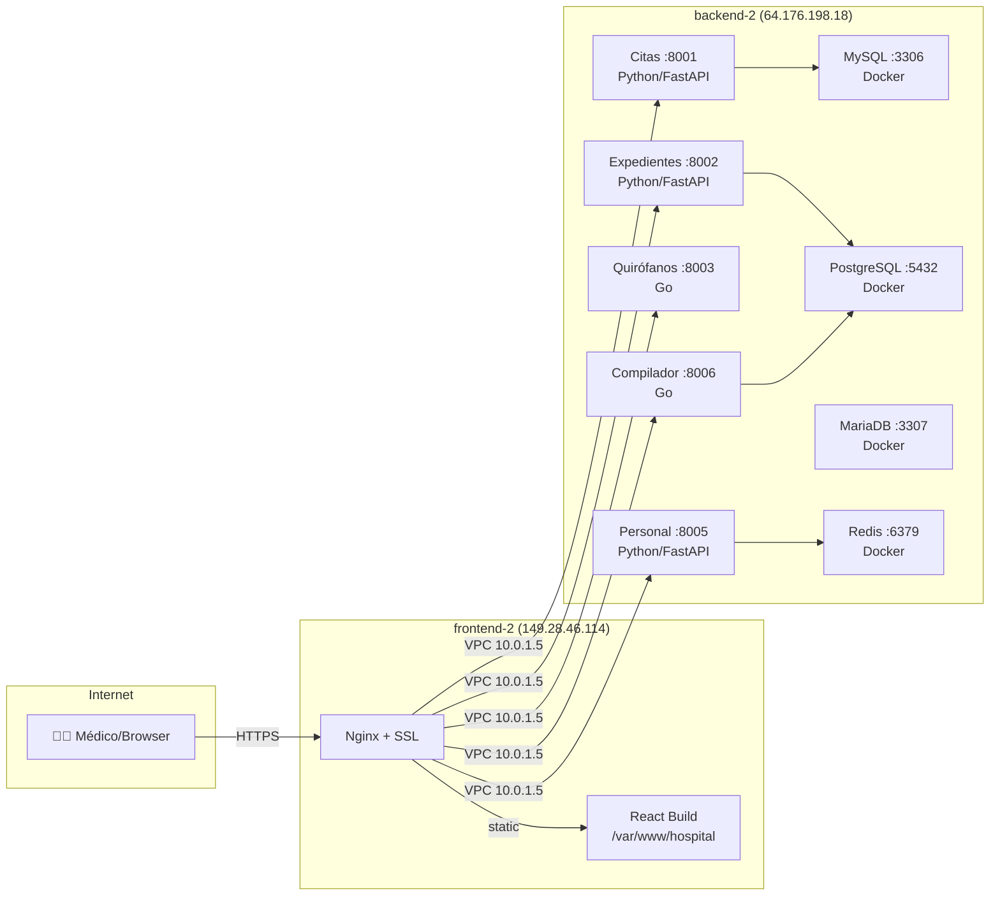

# 🏥 Guía de Despliegue en Linux (Vultr VPS)

Guía completa para desplegar el sistema hospitalario en dos servidores Ubuntu.

## Arquitectura



---

## Paso 0: Preparación Local (tu Windows)

Antes de tocar los servidores, sube todos los scripts al repositorio:

```powershell
cd "C:\Users\josea\OneDrive\Documents\Sexto Semestre\proyectocomtd4"
git add deploy/
git commit -m "feat: add Linux deployment scripts"
git push origin main
```

---

## Paso 1: Configurar DNS

> **IMPORTANTE:** Esto se hace en el **panel de tu proveedor de dominio** (Cloudflare, Namecheap, GoDaddy, Vultr DNS, etc.)

### Registros DNS a crear:

| Tipo | Nombre | Valor | TTL |
|------|--------|-------|-----|
| **A** | `hospital.stolsimprojects.tech` | `149.28.46.114` | 300 |
| **A** | `api.hospital.stolsimprojects.tech` | `64.176.198.18` | 300 |

> **TIP:** Si usas **Vultr DNS**, ve a: Products → DNS → Add Domain, y agrega los registros A ahí.
> Si usas **Cloudflare**, asegúrate de que el proxy (nube naranja) esté **desactivado** (solo DNS / nube gris) para que Certbot pueda verificar.

### Verificar que el DNS propagó:

```bash
nslookup hospital.stolsimprojects.tech
# Debe responder: 149.28.46.114
```

---

## Paso 2: Provisionar el Backend

```bash
ssh root@64.176.198.18
```

Una vez dentro:

```bash
git clone https://github.com/ProtoFurOwO/proyectohospital.git /opt/hospital
cd /opt/hospital
chmod +x deploy/*.sh
bash deploy/backend-setup.sh
```

### Poblar datos de prueba:

```bash
bash deploy/seed-linux.sh
```

### Iniciar todos los servicios:

```bash
# Foreground (para ver logs en vivo, Ctrl+C para detener)
bash deploy/start-backend.sh

# Background (producción)
nohup bash deploy/start-backend.sh > /opt/hospital/logs/main.log 2>&1 &
```

### Verificar:

```bash
curl http://localhost:8001/health   # Citas
curl http://localhost:8002/health   # Expedientes
curl http://localhost:8003/health   # Quirófanos
curl http://localhost:8005/health   # Personal
curl http://localhost:8006/health   # Compilador
```

---

## Paso 3: Provisionar el Frontend

```bash
ssh root@149.28.46.114
```

Una vez dentro:

```bash
git clone https://github.com/ProtoFurOwO/proyectohospital.git /opt/hospital
cd /opt/hospital
chmod +x deploy/*.sh
bash deploy/frontend-setup.sh hospital.stolsimprojects.tech
```

### Verificar:

```bash
curl http://localhost/
curl http://localhost/api/v1/health/citas
```

---

## Paso 4: SSL con Let's Encrypt

> **IMPORTANTE:** El DNS debe estar ya propagado (Paso 1).

```bash
# En el servidor FRONTEND (149.28.46.114)
certbot --nginx -d hospital.stolsimprojects.tech
```

Certbot te pedirá:
1. **Email** → tu email
2. **Terms of Service** → `Y`
3. **Redirect HTTP to HTTPS** → `2` (redirigir)

### Verificar:

```bash
curl https://hospital.stolsimprojects.tech/
```

### Renovación automática:

```bash
certbot renew --dry-run
```

---

## Paso 5: Blindaje de Red (Aislar el Backend)

> [!CAUTION]
> **ESTE PASO ES CRÍTICO:** Aquí es donde aseguramos que nadie pueda entrar al backend excepto tú (SSH) y el Frontend (VPC).

### En backend-2 (64.176.198.18):

```bash
# 1. Por defecto, denegar toda entrada
ufw default deny incoming
ufw default allow outgoing

# 2. Permitir SSH (¡IMPORTANTE para no quedarte fuera!)
ufw allow ssh

# 3. Permitir TODO el tráfico desde la red privada VPC (Frontend)
# Ajusta el rango si tu VPC es diferente, pero 10.0.0.0/8 cubre todo lo privado de Vultr
ufw allow from 10.0.0.0/8

# 4. Habilitar firewall
ufw enable
```

**Resultado:** Si alguien intenta entrar a `64.176.198.18:8001` desde su casa, el servidor ni siquiera le responderá. Pero si el Frontend (`10.0.1.6`) le pide algo a la `10.0.1.5:8001`, pasará sin problemas.

---

## Paso 6: Verificación Final de Aislamiento

1.  **Desde tu PC (público):**
    *   Prueba: `curl http://64.176.198.18:8001/health`
    *   Debe: **Quedarse cargando o dar Timeout** (No debe responder).
2.  **Desde el Frontend VPS:**
    *   Prueba: `curl http://10.0.1.5:8001/health`
    *   Debe: **Responder `{"status":"ok", ...}`** instantáneamente.


---

## Comandos Útiles

### Backend (64.176.198.18):

```bash
# Ver logs
tail -f /opt/hospital/logs/citas.log

# Ver Docker
docker ps
docker logs hospital-mysql-citas

# Reiniciar
bash deploy/stop-backend.sh
bash deploy/start-backend.sh

# Actualizar
git pull origin main
cd backend && go build -o ../bin/quirofanos ./cmd/quirofanos && go build -o ../bin/compiler ./cmd/compiler && cd ..
bash deploy/stop-backend.sh
bash deploy/start-backend.sh
```

### Frontend (149.28.46.114):

```bash
# Actualizar
cd /opt/hospital && git pull origin main
cp deploy/.env.production frontend/.env.production
cd frontend && npm run build && cd ..
cp -r frontend/dist/* /var/www/hospital/
nginx -s reload
```
